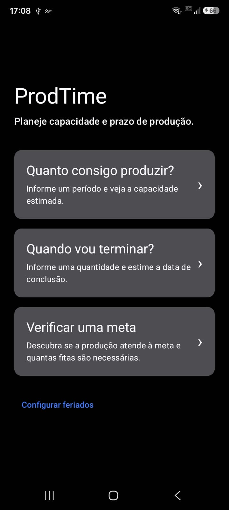
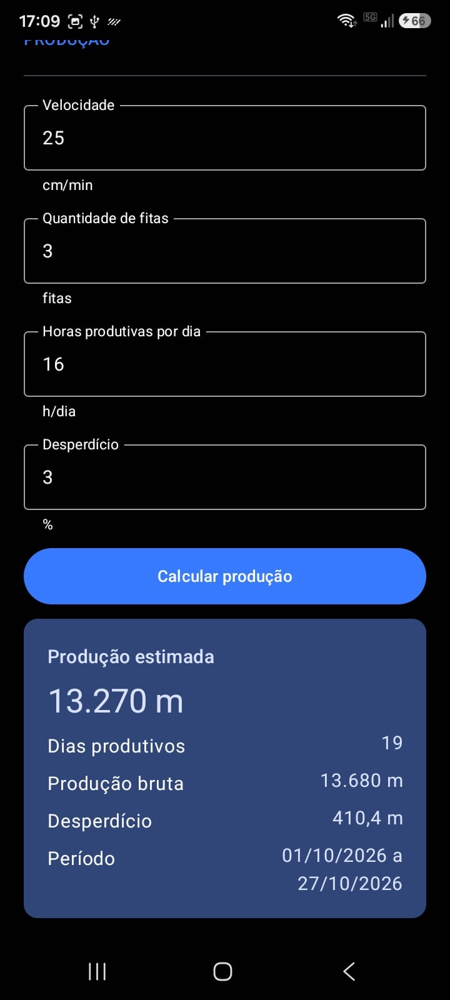
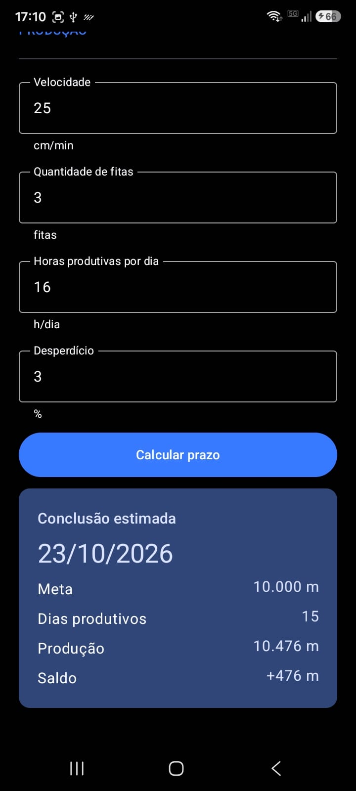
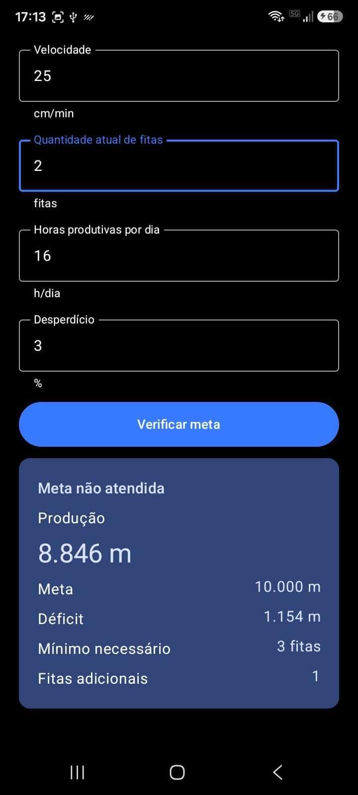

# ProdTime

Planejamento rápido de capacidade e prazo para produção de fitas têxteis.


Prévia gráfica da identidade relógio + fita; não é captura de launcher. Consulte a [identidade visual](docs/branding/BRAND_IDENTITY.md).

## Visão geral

O ProdTime ajuda profissionais de produção e vendas a estimar capacidade e prazo sem depender de cálculos manuais concentrados em pessoas experientes. A solução nasceu de uma calculadora desenvolvida pelo autor em VBA e integrada a um ERP legado.

O aplicativo Android reúne três jornadas: estimar produção em um período, encontrar a primeira data suficiente para uma meta e verificar sua viabilidade. Os cálculos são locais e determinísticos: as mesmas entradas e políticas produzem os mesmos resultados.

O MVP funcional e o artigo acadêmico estão concluídos. A identidade do aplicativo está aprovada; os materiais de apresentação seguem em preparação. Consulte o [escopo](docs/product/PROJECT_SCOPE.md) e o [rollout](docs/process/ROLLOUT.md).

## Funcionalidades

### Quanto consigo produzir?

Recebe período inicial/final, velocidade em cm/min, fitas simultâneas, horas produtivas por dia, desperdício e políticas de calendário. Apresenta produção líquida, produção bruta, desperdício e dias produtivos.

### Quando vou terminar?

Recebe meta em metros inteiros, data inicial, condições produtivas e calendário. Não exige data final: percorre as datas progressivamente até a primeira cuja produção líquida acumulada atende à meta. Retorna conclusão estimada, dias produtivos, produção e saldo.

### Verificar uma meta

Compara a produção estimada no período com a meta. Informa atendimento, déficit ou excedente, mínimo necessário de fitas e fitas adicionais, mantendo os demais parâmetros constantes. Em períodos sem dias produtivos, a recomendação de fitas não se aplica.

### Calendário e feriados

Permite configurar inclusão das datas inicial/final, trabalho aos sábados, domingos e feriados. Feriados podem ser anuais ou de data específica; ocorrências coincidentes não são descontadas duas vezes. Trabalhar em um feriado não libera um fim de semana excluído. Os cadastros são compartilhados pelos três fluxos em memória durante a sessão.

### Robustez e interação

- Validações por campo, limites operacionais e limpeza do erro ao editar a entrada correspondente.
- Decimais com vírgula ou ponto; sanitização de espaços e caracteres Unicode invisíveis previstos, com rejeição de texto inválido.
- Semântica de acessibilidade, fonte ampliada, formulários roláveis e navegação por teclado/Back.
- Temas claro e escuro, mensagens textuais de resultado e cópia de resultados.
- Tela **Sobre o ProdTime**, com finalidade, autoria, instituição e contato.

## Screenshots

Capturas reais utilizadas nas validações e no artigo. Foram registradas antes da identidade de R10.1; a Home exibida ainda não contém a descrição final nem o acesso à tela Sobre. Os arquivos originais foram preservados.

<table>
  <tr>
    <th>Tela inicial</th>
    <th>Estimativa de produção</th>
  </tr>
  <tr>
    <td></td>
    <td></td>
  </tr>
  <tr>
    <th>Estimativa de prazo</th>
    <th>Viabilidade da meta</th>
  </tr>
  <tr>
    <td></td>
    <td></td>
  </tr>
</table>

## Tecnologias

- Android nativo e Kotlin.
- Jetpack Compose e Material 3 para interface e temas.
- `BigDecimal` para cálculos decimais e `java.time` para datas e calendário.
- Gradle Wrapper para build e JUnit 4 para testes JVM.

## Arquitetura

A UI Compose coleta e valida entradas, coordena o estado e apresenta resultados. Ela chama as calculadoras que compõem as regras de capacidade e calendário. Todos os componentes abaixo pertencem ao domínio Kotlin puro, independente de Android/Compose:

| Componente | Responsabilidade |
|---|---|
| `ProductionCapacityCalculator` | Produção bruta, desperdício, produção líquida e saldo. |
| `ProductiveCalendarCalculator` | Classificação das datas e contagem dos dias produtivos. |
| `HolidayResolver` | Resolução e deduplicação das ocorrências de feriados. |
| `ProductionEstimateCalculator` | Composição de feriados, calendário e capacidade de um período. |
| `ProductionDeadlineCalculator` | Busca da primeira data suficiente para a meta. |
| `ProductionViabilityAdvisor` | Comparação com a meta e cálculo do mínimo/adicional de fitas. |

A navegação usa estado Compose e os feriados são compartilhados em memória. Detalhes na [arquitetura](docs/architecture/ARCHITECTURE.md).

## Regras principais

A conversão de velocidade é `m/h = (cm/min × 60) / 100`. A produção bruta decimal multiplica essa velocidade por fitas simultâneas, horas por dia e dias produtivos.

A produção bruta é arredondada para metros inteiros com `HALF_EVEN`. O desperdício percentual incide sobre essa produção bruta já arredondada, preservando casas decimais. A produção líquida resulta da subtração do desperdício e recebe o mesmo arredondamento integral. Em empates, `HALF_EVEN` escolhe o inteiro par mais próximo.

Unidades, contratos e fronteiras estão na [especificação de cálculo](docs/domain/CALCULATION_SPEC.md); as [regras de negócio](docs/product/BUSINESS_RULES.md) resumem os três fluxos.

## Validação e testes

Na versão atual das fontes JVM existem **118 métodos anotados com `@Test`**. A suíte cobre capacidade e arredondamento, calendário, feriados, três fluxos, parsing, sanitização, limites e apresentação. A [matriz de regressão](docs/testing/REGRESSION_MATRIX.md) relaciona cenários e testes reais.

As tarefas `testDebugUnitTest` e `assembleDebug` terminaram com `BUILD SUCCESSFUL` nos gates documentados. No Cloud, a primeira execução de R10.1 registrou 118 testes JVM nos relatórios XML, sem falhas, erros ou testes ignorados. Tarefas posteriores reportadas como `UP-TO-DATE` não demonstram nova execução de todos os testes. O APK de teste instrumentado foi compilado; sua execução em dispositivo não está registrada.

A validação física no **Samsung SM-A066M** aprovou as três jornadas, feriados, teclado/cursor, cópia, limites e sanitização nos cenários registrados. Para a identidade, o autor informou aprovação local/física do novo ícone, Home e Sobre em claro/escuro, fonte ampliada, Back, rolagem e dados acadêmicos. Esses resultados são relativos ao aparelho e cenários avaliados, sem alegação de cobertura percentual ou compatibilidade universal.

Evidências e distinção entre execução, contagem estática e relato do autor em [Validações](docs/process/VALIDATIONS.md). R10.2 é documental e não executou Gradle.

## Casos de referência

Condições comuns: 25 cm/min, 16 h/dia, desperdício de 3%, sem trabalho aos sábados/domingos e sem feriados. Para produção e viabilidade, período inclusivo de 01/10/2026 a 27/10/2026: 19 dias produtivos. Para prazo, início em 05/10/2026 e três fitas.

| Caso | Resultado documentado |
|---|---|
| Produção com 2 fitas | 8.846 m líquidos. |
| Produção com 3 fitas | 13.270 m líquidos. |
| Prazo para 10.000 m | 23/10/2026; 15 dias produtivos; 10.476 m; saldo +476 m. |
| Viabilidade de 10.000 m com 2 fitas | Déficit de 1.154 m; mínimo de 3 fitas; 1 fita adicional. |

## Como executar

Na raiz do repositório, use JDK compatível com o Android Gradle Plugin (17 ou superior), Android SDK configurado com plataforma API 36 e ferramentas de build compatíveis. O Gradle Wrapper usa a distribuição declarada no projeto e precisa estar disponível ou acessível para download. Para instalar, disponibilize um emulador ou aparelho Android **API 26 ou superior**, com ADB e depuração habilitada.

Windows (PowerShell):

```powershell
.\gradlew.bat testDebugUnitTest
.\gradlew.bat assembleDebug
```

Linux/macOS (Bash):

```bash
bash ./gradlew testDebugUnitTest
bash ./gradlew assembleDebug
```

APK debug gerado: `app/build/outputs/apk/debug/app-debug.apk`.

Com o dispositivo conectado e autorizado, instale e abra o ProdTime:

```bash
adb devices
adb install -r app/build/outputs/apk/debug/app-debug.apk
```

Package/applicationId: `br.com.prodtime`. Versão atual: `1.0`, código `1`; a release `1.0.0` está reservada ao R11.

## Estrutura do projeto

```text
app/                 # Aplicativo Android, domínio e testes
docs/
  academic/          # Artigo, figuras e fonte/PDF SBC
  architecture/      # Separação entre apresentação e domínio
  branding/          # Identidade visual e prévias documentais
  domain/            # Contratos matemáticos e de calendário
  product/           # Problema, escopo e regras de negócio
  process/           # Rollout, decisões e validações
  testing/           # Matriz de regressão
  ux/                # UX e acessibilidade
```

## Limitações

- Operação local, sem backend ou integração com máquinas em tempo real.
- Feriados mantidos somente em memória; encerrar o processo descarta os cadastros.
- Parâmetros constantes por estimativa, informados pelo usuário; disponibilidade real de máquinas não é consultada.
- Ausência de IA e PCP. As respostas são estimativas condicionais, sem promessa operacional.
- Validação restrita às evidências registradas; não há estudo amplo com usuários nem ganhos industriais mensurados.

## Trabalhos futuros

Possibilidades já documentadas: integração com ERP Web e PCP, persistência de feriados e histórico de estimativas, consulta à disponibilidade de máquinas e capacidade variável por intervalos. IA para análise de históricos e IoT para coleta de dados produtivos dependem de requisitos, dados e validações próprios. **Esses recursos não fazem parte da versão atual.**

## Contexto acadêmico

Projeto Integrador de **Josué Paulo Alexandrina**, do curso **Análise e Desenvolvimento de Sistemas (ADS)**, na **Gran Faculdade**.

O [artigo acadêmico produzido em formato SBC](docs/academic/submission/prodtime_sbc_preview.pdf) documenta problema, método, solução e resultados. A versão editorial contém 11 páginas; eventual adequação ao limite institucional depende de uma regra ainda não informada. A [fonte textual consolidada](docs/academic/ARTICLE_FINAL.md) e as fontes de diagramação permanecem disponíveis no repositório.

## Autoria

Desenvolvido por **Josué Paulo Alexandrina**.

E-mail: [josue_jpaej@hotmail.com](mailto:josue_jpaej@hotmail.com).
